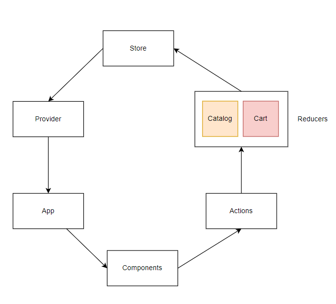

# Reactronics

## Redux
### Redux Flow

### Reducer
Current State + Action &rarr; Next State

### Best Practices
1. No state mutation
2. Reducer as pure function
3. Only serializable values in state or action
4. One store per app